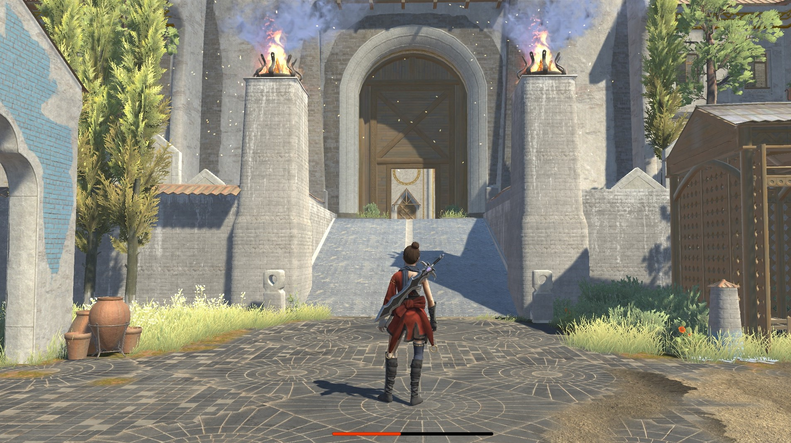
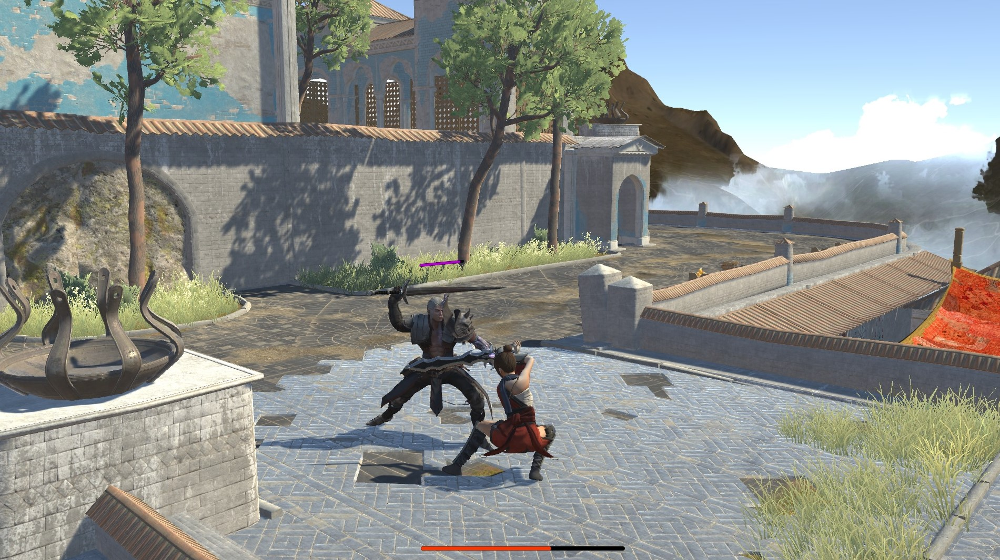
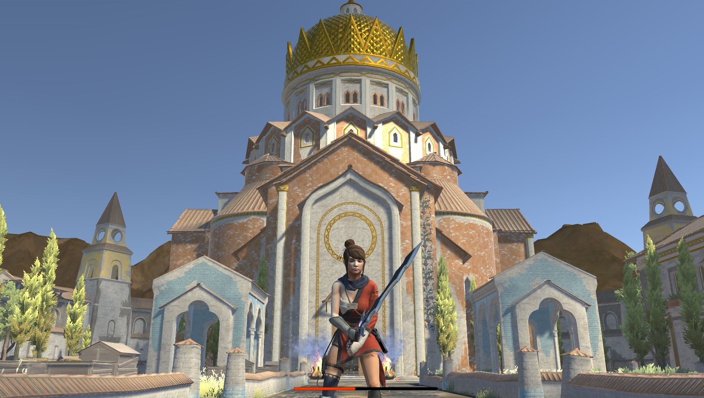
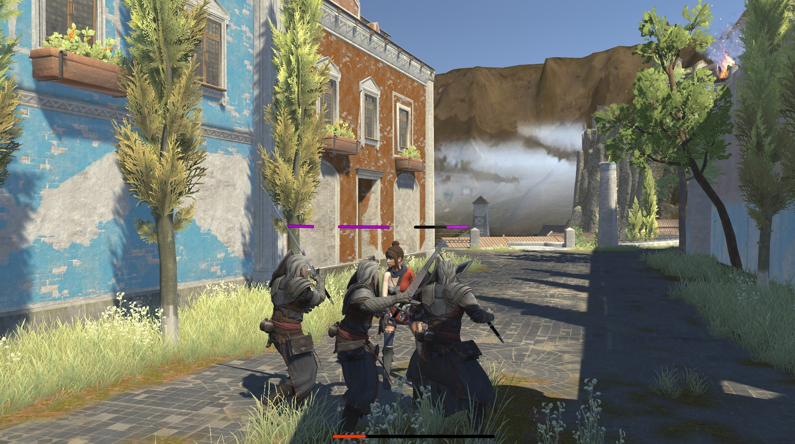
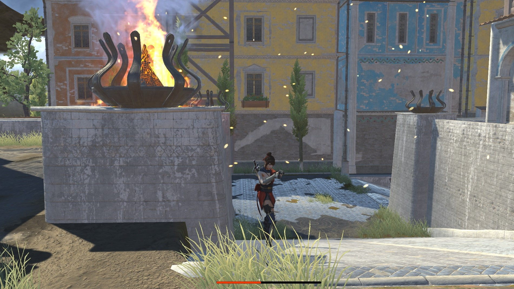

# AkhShig-Unity-3D-Video-Game

> AkhShig is a video game (FPS), that was created by Unity 3D, and it is about a brave girl who has some abilities to use a sword and gun to fight with enemies in an old town with a beautiful environment.

By using a smooth Cinemachine technique, you are able to control the player in the scene as in real life.

The main player has the ability to walk, run, jump, go up and down of stairs and gets defend position at any sword attack.
She has the ability to use a gun and aim any enemies which are in her aiming position and destroy them.

Enemies are designed to walk, run, jump, go up and down of stairs, and also follow the player once she gets into their zone and start to fight if the player is armed, while they are able to back to their position and do their duty once she gets out of their viewing angles.

## Built With

- Major platform: Unity 3D
- Major language: C#

## Live Demo

[Watch some videos of Akshig's scenes.](https://ebrahimisiavash.wixsite.com/siavash-portfolio)
